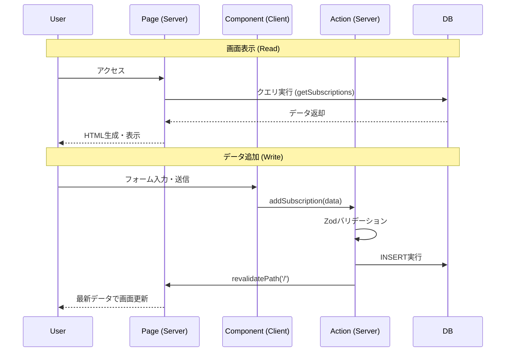

# Test_Project_one

-----

# 基本設計書: サブスクリプション一元管理ダッシュボード

## 1\. プロジェクト概要

  * **名称:** Subscription Manager (仮)
  * **目的:** 散らばりがちなSaaSやサブスクリプション契約を一元管理し、固定費（Monthly/Yearly）を可視化する。
  * **ターゲット:** 個人開発者、フリーランス、小規模チーム。

## 2\. 技術スタック (Tech Stack)

最新のNext.jsエコシステムを採用し、\*\*「APIレス」**かつ**「型安全」\*\*な開発を実現する構成。

| カテゴリ | 技術選定 | 役割 |
| :--- | :--- | :--- |
| **Framework** | **Next.js 14+ (App Router)** | フルスタックフレームワーク |
| **Language** | **TypeScript** | 静的型付けによる品質担保 |
| **Styling** | **Tailwind CSS** | ユーティリティファーストなCSS |
| **UI Library** | **shadcn/ui** | アクセシビリティ対応コンポーネント集 |
| **Database** | **PostgreSQL** | リレーショナルデータベース |
| **ORM** | **Drizzle ORM** | 軽量かつ型安全なSQLビルダー |
| **Validation** | **Zod** | スキーマ検証 (Frontend/Backend共通) |
| **Icon** | **Lucide React** | 軽量アイコンセット |

-----

## 3\. アプリケーション・アーキテクチャ

Next.jsの **Server Actions** を活用し、従来のREST API層を排除したシンプルな構成です。

### ディレクトリ構造

```text
app/
 ├── actions.ts           # Server Actions (DB操作ロジック)
 ├── page.tsx             # メイン画面 (Server Component / データ取得)
 └── _components/         # 画面固有のUIパーツ
      ├── add-button.tsx  # 追加モーダル (Client Component)
      ├── sub-list.tsx    # 一覧表示テーブル
      └── del-button.tsx  # 削除アラート (Client Component)
db/
 ├── schema.ts            # Drizzleスキーマ定義
 └── index.ts             # DB接続設定
lib/
 └── schema.ts            # Zodバリデーション定義 (共通)
```

### データフロー (概念図)



-----

## 4\. データベース設計 (Schema)

**テーブル名:** `subscriptions`

ユーザー1人が複数のサブスクリプションを持つ「1対多」の関係を想定しています（現在はMVPのためユーザーIDは固定）。

| カラム名 | 型 (Type) | 必須 | 説明 |
| :--- | :--- | :--- | :--- |
| `id` | UUID | PK | 一意の識別子 (defaultRandom) |
| `user_id` | Text | YES | 所有ユーザーID (Auth連携用) |
| `name` | Text | YES | サービス名 (例: Netflix) |
| `price` | Integer | YES | 金額 |
| `currency` | Text | YES | 通貨 (Default: JPY) |
| `cycle` | Enum | YES | `monthly` または `yearly` |
| `next_payment`| Date | YES | 次回支払日 |
| `is_active` | Boolean | YES | 契約状態 (Default: true) |
| `created_at` | Timestamp | YES | 作成日時 |

-----

## 5\. UI/UX コンポーネント設計

### A. Dashboard Page (`page.tsx`)

画面全体のレイアウトとデータフェッチを担当。

  * **KPI Cards:**
      * 「月額固定費合計」: `cycle = 'monthly'` の合計を表示。
      * 「契約数」: レコードの総数を表示。
  * **Main Content:**
      * サブスクリプション一覧を表示するエリア。

### B. Add Subscription Modal (`add-subscription-button.tsx`)

  * **Trigger:** 「＋ 追加する」ボタン。
  * **UI:** Dialog (Modal) 内にフォームを展開。
  * **Validation:**
      * サービス名: 必須
      * 金額: 数値のみ、1以上
      * サイクル: 選択必須
  * **Feedback:** 送信成功時にダイアログを自動で閉じ、フォームをリセット。

### C. Delete Confirmation (`delete-button.tsx`)

  * **Trigger:** リスト各行のゴミ箱アイコン。
  * **Safety:** `AlertDialog` を使用し、誤操作を防止。「本当に削除しますか？」と確認。
  * **State:** 削除処理中 (`isPending`) はボタンを無効化し、連打を防止。

-----

## 6\. 今後のロードマップ (Next Phase)

MVP完成後の機能拡張案です。

1.  **認証機能の統合 (Auth.js / Clerk)**
      * 固定値の `DEMO_USER_ID` を廃止し、ログインユーザーごとのデータ分離を実現。
2.  **編集 (Edit) 機能**
      * 登録済みデータの修正機能（金額変更、支払日更新など）。
3.  **通貨対応 (Multi-currency)**
      * USD ($) や EUR (€) の入力を可能にし、現在のレートで円換算して合計を表示。
4.  **通知機能 (Notification)**
      * 支払日の3日前にメールやSlackで通知を送る（Vercel Cron Jobs等を利用）。

-----
