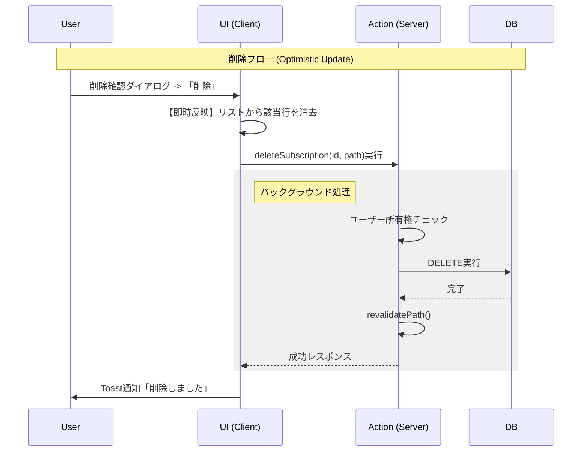

-----

# 設計仕様書: Subscription Manager (v1.0)

## 1\. プロジェクト概要

  * **名称:** Subscription Manager
  * **目的:** 散らばりがちなサブスクリプション契約を一元管理し、固定費を可視化する。
  * **特徴:**
      * **APIレス:** Next.js Server Actionsによる直接的なデータ操作。
      * **型安全:** DBスキーマからフロントエンドまで一貫した型定義 (End-to-End Type Safety)。
      * **高速UX:** Optimistic UI（楽観的更新）によるゼロレイテンシーな操作感。

## 2\. 技術スタック (Tech Stack)

| カテゴリ | 技術選定 | 役割 | 備考 |
| :--- | :--- | :--- | :--- |
| **Framework** | **Next.js 15 (App Router)** | フルスタックFW | Server Actions / UseOptimistic |
| **Language** | **TypeScript** | 言語 | Strict Mode |
| **Styling** | **Tailwind CSS** | スタイリング | |
| **UI Library** | **shadcn/ui** | コンポーネント | Dialog, Table, Alert Dialog, Select |
| **Feedback** | **Sonner** | 通知 (Toast) | ノンブロッキングなUX |
| **Database** | **PostgreSQL** | RDB | `postgres` (client) |
| **ORM** | **Drizzle ORM** | DB操作 | `drizzle-kit` によるマイグレーション |
| **Validation** | **Zod** | スキーマ検証 | `z.coerce` による型変換含む |

## 3\. アプリケーション・アーキテクチャ

### 3.1 ディレクトリ構造 (v1.1)

機能（Features）と責務（Concerns）に基づき整理されています。`constants.ts` の導入により定数管理を一元化しました。

```text
app/
 ├── actions.ts                  # Server Actions (DB操作・認証・検証・Revalidation)
 ├── page.tsx                    # メイン画面 (Server Component / データ集計)
 └── _components/                # プレゼンテーション層
      ├── add-subscription-button.tsx  # 追加モーダル (Client / Form Control)
      └── subscription-list.tsx        # 一覧リスト (Client / Optimistic UI / 削除確認)
db/
 ├── index.ts                    # DB接続クライアント (Singleton / Env Check)
 └── schema.ts                   # Drizzleスキーマ & 型定義 (Single Source of Truth)
lib/
 ├── constants.ts                # 定数定義 (Currency, Cycle, Labels)
 ├── utils.ts                    # 純粋関数 (通貨変換, 日付計算, Class Merge)
 └── validations.ts              # Zodスキーマ (Form Validation)
```

### 3.2 データフロー (Optimistic UI)

ユーザーの操作感を最優先するため、\*\*「サーバーの完了を待たずに画面を更新する」\*\*フローを採用しています。



## 4\. データベース設計

**テーブル名:** `subscriptions`

マジックナンバーや文字列のハードコーディングを防ぐため、アプリ側の `constants.ts` と連携した定義を行います。

| カラム名 | 型 | 制約/Default | 定数参照 | 説明 |
| :--- | :--- | :--- | :--- | :--- |
| `id` | UUID | PK, Default Random | - | - |
| `user_id` | Text | Not Null | - | 所有者ID (Indexあり) |
| `name` | Text | Not Null | - | サービス名 |
| `price` | Integer | Not Null | - | **通貨の最小単位** (例: 100円=100, $10.99=1099) |
| `currency` | Text | Default: 'JPY' | `CURRENCIES` | 通貨コード (JPY, USD, EUR) |
| `cycle` | Text | Not Null | `SUBSCRIPTION_CYCLES` | `monthly` / `yearly` |
| `next_payment` | Date | Not Null | - | YYYY-MM-DD |
| `category` | Text | Default: 'general' | - | カテゴリ分類 (Optional) |
| `is_active` | Boolean | Default: true | - | 有効/無効フラグ |
| `created_at` | Timestamp | Default Now | - | - |

## 5\. ロジック & ビジネスルール

### 5.1 通貨・金額計算 (Minor Units Handling)

浮動小数点誤差を防ぐため、金額は「最小通貨単位（Minor Units）」の整数としてDBに保存します。

  * **DB保存 (Write):**
      * UI入力値（例: `9.99` USD）を `constants.ts` の `decimals` 設定に基づき変換。
      * 計算式: `Input * (10 ^ decimals)` -\> `999`
  * **UI表示 (Read):**
      * DB値（例: `999`）を元の単位に戻して表示。
      * 計算式: `DBValue / (10 ^ decimals)` -\> `9.99`
  * **月額固定費の算出:**
      * `cycle === 'yearly'` の場合、実数に戻した金額を `12` で除算して合算する。
      * 現在は `JPY` のみ集計対象とする。

### 5.2 日付管理 (Timezone Handling)

  * **課題:** `new Date()` (UTC) による日付ズレ。
  * **解決策:** `lib/utils.ts` の `getLocalTodayString()` を使用し、ブラウザ（ローカル環境）基準の `YYYY-MM-DD` 文字列を初期値として提供する。

### 5.3 バリデーション (Validation)

`lib/validations.ts` のZodスキーマにより、以下のルールを強制する。

  * **Price:** 0.01以上の数値（マイナス不可）。
  * **Currency:** 定義済み通貨コード (`JPY`, `USD`, `EUR`) のみ。
  * **Next Payment:** `Date` として有効かつ、2000年以降の日付であること。

## 6\. セキュリティ設計

Server Actionsは公開APIエンドポイントと同等であるため、以下の対策を実装済み。

  * **所有者検証 (Ownership Verification):**
      * `getCurrentUser()` (Mock/Auth) から取得したIDを使用。
      * DELETE操作では `WHERE id = ? AND user_id = ?` を強制し、他人のデータを削除できないように制御。
  * **Fail Fast:**
      * DB接続設定 (`db/index.ts`) にて、環境変数 `DATABASE_URL` が欠落している場合は即座に例外をスローし、起動させない。

## 7\. 今後の拡張ロードマップ

実装完了済みの基盤により、以下の拡張が可能です。

1.  **認証機能の完全統合 (Clerk / Auth.js)**
      * `actions.ts` 内の `getCurrentUser` モック関数を差し替えるのみ。
2.  **多通貨集計 (Multi-currency Aggregation)**
      * 現在はJPYのみを集計しているが、為替レートAPIを導入し、`calculateMonthlyTotal` 関数内で動的にレート換算を行うことで全通貨の合算が可能。
3.  **カテゴリ管理機能**
      * DBカラム `category` は実装済み。UIにフィルタリング機能を追加可能。

-----
