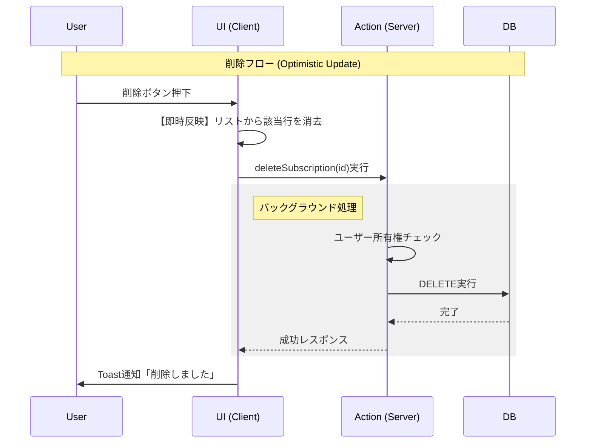

-----

# 設計仕様書: Subscription Manager (v1.0 Final)

## 1\. プロジェクト概要

  * **名称:** Subscription Manager
  * **目的:** 散らばりがちなサブスクリプション契約を一元管理し、固定費を可視化する。
  * **特徴:**
      * **APIレス:** Next.js Server Actionsによる直接的なデータ操作。
      * **型安全:** DBスキーマからフロントエンドまで一貫した型定義 (End-to-End Type Safety)。
      * **高速UX:** Optimistic UI（楽観的更新）によるゼロレイテンシーな操作感。

## 2\. 技術スタック (Tech Stack)

| カテゴリ | 技術選定 | 役割 | 備考 |
| :--- | :--- | :--- | :--- |
| **Framework** | **Next.js 15 (App Router)** | フルスタックFW | Server Actions / UseOptimistic |
| **Language** | **TypeScript** | 言語 | Strict Mode |
| **Styling** | **Tailwind CSS** | スタイリング | |
| **UI Library** | **shadcn/ui** | コンポーネント | Dialog, Table, Card, Button |
| **Feedback** | **Sonner** | 通知 (Toast) | ノンブロッキングなUX |
| **Database** | **PostgreSQL** | RDB | |
| **ORM** | **Drizzle ORM** | DB操作 | `drizzle-kit` によるマイグレーション |
| **Validation** | **Zod** | スキーマ検証 | Backend/Frontend共通利用 |

## 3\. アプリケーション・アーキテクチャ

### 3.1 ディレクトリ構造 (最終版)

機能（Features）と責務（Concerns）に基づき整理されています。

```text
app/
 ├── actions.ts                  # Server Actions (DB操作・認証・検証)
 ├── page.tsx                    # メイン画面 (Server Component / データ取得)
 └── _components/                # プレゼンテーション層
      ├── add-subscription-button.tsx  # 追加モーダル (Client / Toast対応)
      └── subscription-list.tsx        # 一覧リスト (Client / Optimistic UI対応)
db/
 ├── index.ts                    # DB接続クライアント
 └── schema.ts                   # Drizzleスキーマ & 型定義 (Single Source of Truth)
lib/
 ├── constants.ts                # 定数定義 (Enum, Label, Currency)
 ├── utils.ts                    # 純粋関数 (日付計算, ビジネスロジック)
 └── validations.ts              # Zodスキーマ (Form Validation)
```

### 3.2 データフロー (Optimistic UI)

ユーザーの操作感を最優先するため、\*\*「サーバーの完了を待たずに画面を更新する」\*\*フローを採用しています。



## 4\. データベース設計

**テーブル名:** `subscriptions`

マジックナンバーや文字列のハードコーディングを防ぐため、アプリ側の `constants.ts` と連携した定義を行います。

| カラム名 | 型 | 制約/Default | 定数参照 | 説明 |
| :--- | :--- | :--- | :--- | :--- |
| `id` | UUID | PK, Default Random | - | - |
| `user_id` | Text | Not Null | - | 所有者ID (Auth連携用) |
| `name` | Text | Not Null | - | サービス名 |
| `price` | Integer | Not Null | - | 金額 |
| `currency` | Text | Default: 'JPY' | `CURRENCIES` | 通貨コード |
| `cycle` | Text | Not Null | `SUBSCRIPTION_CYCLES` | `monthly` / `yearly` |
| `next_payment` | Date | Not Null | - | YYYY-MM-DD |
| `created_at` | Timestamp | Default Now | - | - |

## 5\. ロジック & ビジネスルール

### 5.1 ビジネスロジック (Calculation)

UIコンポーネント内に計算ロジックを持たせず、`lib/utils.ts` に分離。

  * **月額固定費の算出:**
      * `cycle === 'monthly'` : そのまま加算。
      * `cycle === 'yearly'` : `price / 12` (四捨五入) して加算。
      * これにより、支払いサイクルが異なる契約も「月あたりの負担額」として比較可能にする。

### 5.2 日付管理 (Timezone Handling)

  * **課題:** `new Date()` はUTC基準のため、日本時間の深夜〜朝9時に操作すると「昨日」の日付になる。
  * **解決策:** ブラウザのタイムゾーンオフセットを考慮した `getLocalTodayString()` ユーティリティを使用し、常にユーザーの現地時間の「今日」を初期値とする。

### 5.3 バリデーション (Validation)

`lib/validations.ts` に集約されたZodスキーマにより、以下のルールを強制する。

  * **Service Name:** 1文字以上必須。
  * **Price:** 1以上の数値。
  * **Cycle:** 定数リスト (`monthly`, `yearly`) に含まれる値のみ許容。

## 6\. セキュリティ設計

Server Actionsは公開APIエンドポイントと同等であるため、以下の対策を実装済み。

  * **所有者検証 (Ownership Verification):**
      * UPDATE / DELETE 操作時には、必ず `WHERE id = ? AND user_id = ?` の条件を使用。
      * IDを知り得た第三者による不正な削除・改ざんを防止。

## 7\. 今後の拡張ロードマップ

基盤コードが整ったため、以下の機能拡張がスムーズに行えます。

1.  **認証機能の統合 (Auth.js / Clerk)**
      * `DEMO_USER_ID` 定数を、セッションから取得した `userId` に置き換えるだけで対応完了。
2.  **多通貨対応 (Multi-currency)**
      * `currency` カラムは実装済み。`lib/utils.ts` の計算ロジックに為替レート変換を追加するだけで機能する。
3.  **編集機能 (Edit Mode)**
      * `add-subscription-button.tsx` を流用し、初期値 (`defaultValues`) を渡す形での実装が可能。

-----

この設計書は、今回のリファクタリングで実装されたコードベースと完全に一致しています。開発チーム（あるいは未来の自分）への引き継ぎ資料としてご利用ください。
